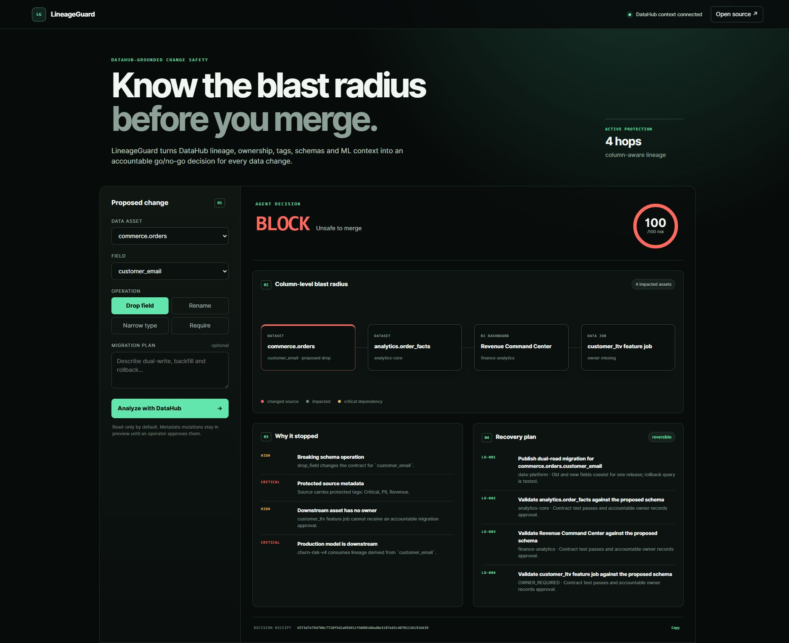

# LineageGuard

**Know the blast radius before you merge.**

LineageGuard is a DataHub-grounded change-safety agent. It reads entity,
schema, ownership, tag, and multi-hop lineage context through DataHub's
official MCP server; predicts which dashboards, pipelines, and ML models a
schema change can break; and returns an accountable `ALLOW`, `REVIEW`, or
`BLOCK` decision with owner-scoped recovery tickets.

## Why it exists

Schema reviews fail when context is scattered across warehouse DDL, dbt,
dashboards, orchestration, model registries, and tribal knowledge. DataHub
already joins that context into a graph. LineageGuard turns the graph into an
actionable pre-merge safety decision.



## What makes it different

- Column-aware, multi-hop impact analysis rather than table-name matching.
- ML models, critical tags, missing ownership, and production state affect risk.
- Fail-closed for breaking operations without a migration plan.
- Every result includes a deterministic SHA-256 receipt and reversible tickets.
- DataHub mutations (`add_tags`, `save_document`) are preview-only by default.
- Catalog descriptions are treated as untrusted data, never agent policy.

## Run the working demo

No API key or dependency install is required:

```bash
python -m lineageguard.server --port 8780
```

Open <http://127.0.0.1:8780>, choose a schema operation, and run the agent.
The bundled catalog fixture demonstrates a Snowflake source flowing through dbt
and Airflow into an executive Looker dashboard and an MLflow model.

## Run tests

```bash
python -m unittest discover -s tests -v
```

## Connect to DataHub

LineageGuard supports the [official DataHub MCP server](https://github.com/acryldata/mcp-server-datahub) and its tools:
`get_entities`, `list_schema_fields`, `get_lineage`, `add_tags`, and
`save_document`.

1. Configure the official MCP server for a DataHub instance.
2. Keep mutation tools disabled while evaluating.
3. Create a `DataHubMcpClient`, call `start()`, then
   `collect_change_context(dataset_urn)`.
4. Normalize the returned entity/schema/lineage payload into `Catalog` and run
   the deterministic policy engine.

The operator supplies credentials to the official server process at runtime.
LineageGuard stores no DataHub token.

## Safety model

LineageGuard is read-only by default. Suggested graph updates are emitted as
preview objects so a human or CI policy can approve them. Breaking changes
fail closed when critical lineage exists and no tested dual-write/backfill/
rollback plan is provided.

## Project status

Hackathon prototype. The fixture workflow and policy engine are functional and
tested. Production adoption should add organization-specific policies, catalog
pagination, identity-aware authorization, and a durable receipt store.

Licensed under Apache-2.0.
